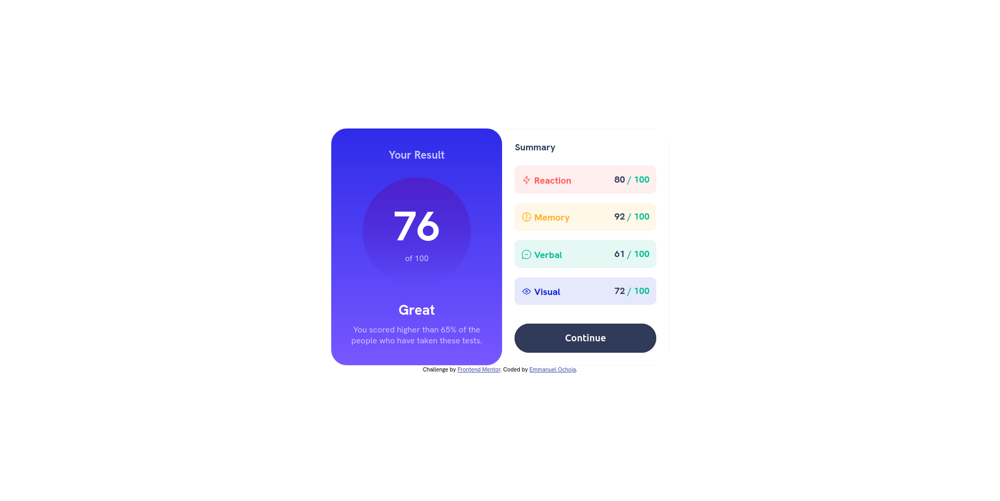
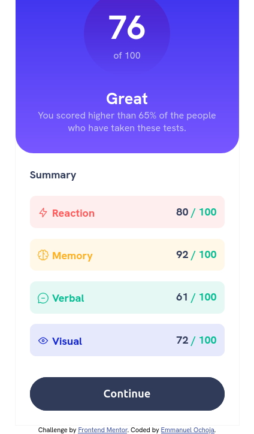

# Frontend Mentor - Results summary component solution

This is a solution to the [Results summary component challenge on Frontend Mentor](https://www.frontendmentor.io/challenges/results-summary-component-CE_K6s0maV). Frontend Mentor challenges help you improve your coding skills by building realistic projects. 

## Table of contents

- [Overview](#overview)
  - [The challenge](#the-challenge)
  - [Screenshot](#screenshot)
  - [Links](#links)
- [My process](#my-process)
  - [Built with](#built-with)
  - [What I learned](#what-i-learned)
  - [Continued development](#continued-development)
- [Author](#author)

## Overview
This is a result summary card, showing the overall score and scores for different components

### The challenge

Users should be able to:

- View the optimal layout for the interface depending on their device's screen size
- See hover and focus states for all interactive elements on the page
- **Bonus**: Use the local JSON data to dynamically populate the 

### Screenshot

### Links

- Solution URL: [Add solution URL here](https://your-solution-url.com)
- Live Site URL: [Add live site URL here](https://your-live-site-url.com)

## My process
- I started with the HTML structure and proceeded to the CSS styling, starting with styling for mobile devices 
- I then styled for Desktop and Tablet devices
- Updated the README

### Built with

- Semantic HTML5 markup
- CSS custom properties
- Flexbox
- Mobile-first workflow

### What I learned
I am enhancing my ability to make website responsive

### Continued development
The next stage is to make the website fetch json data, populate each component and compute the overall data

### Useful resources

## Author

- Github - [Emmanuel Ochoja](https://www.github.com/Airme1)
- Frontend Mentor - [@yourusername](https://www.frontendmentor.io/profile/Airme1)
